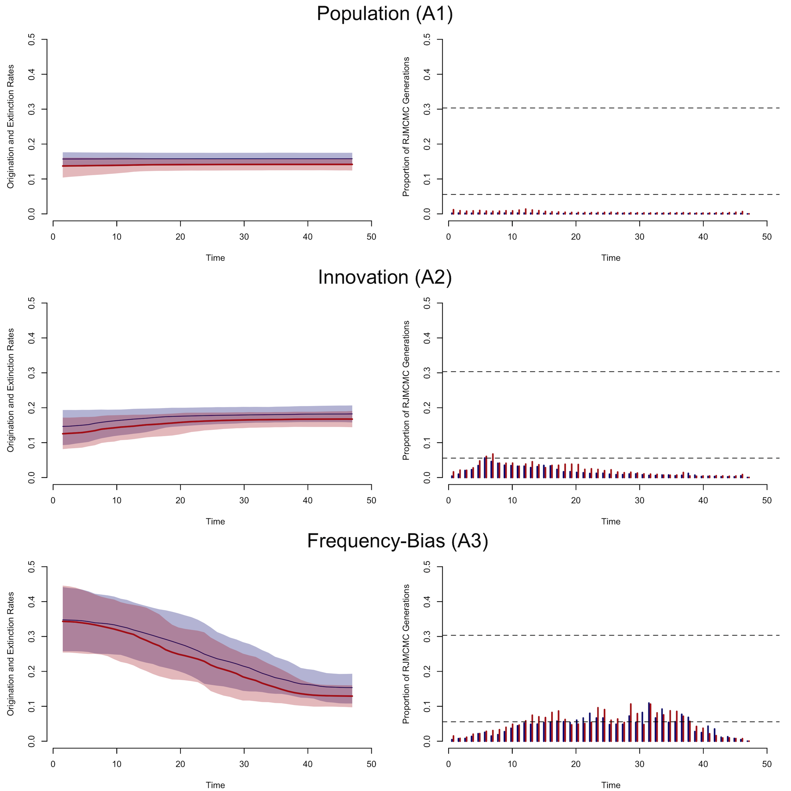

```{r setup, include=FALSE}
knitr::opts_chunk$set(echo = TRUE)
```
## Introduction

This supplemental information contains the code and data necessary to reproduce the analysis associated with manuscript *Analysing the diversification of cultural variants using longitudinal richness data* authored by Erik Gjesfjeld, Enrico Crema, and Anne Kandler. In order to perform the analysis, the user will need to download the LiteRate program which, which can be found at the following [GitHub repository](https://www.github.com/dsilvestro/LiteRate). Users should also have a basic knowledge of R and navigating files and executing commands in a terminal window. It is also preferable that any users have access to computing facilities, such as a cluster, that are able to run multiple analyses in parallel. The data used and created in this analysis, along with the figures, can be found in the following [GitHub](https://www.github.com/erikgjes) and [Figshare]() repositories. 

## Summary of Workflow
:::: {style="display: flex;"}
::: {}
| 1. Develop Models of Change  
|      (a) Scenario A  
|          1 Gradual growth in population  
|          2 Gradual increase in innovation rate
|          3 Gradual shifts away from frequency-bias
|      (b) Scenario B 
|          1 Incremental growth in population
|          2 Incremental increase in innovation rate
|          3 Incremental shift away from frequency-bias
|      (b) Scenario C 
|          1 Rapid growth in population
|          2 Rapid increase in innovation rate
|          3 Rapid shift away from frequency-bias  
|
| 2. Create pseudo-data of each scenario using neutral model  
| $N$ = population size
| $\mu$ = innovation rate
| $b$ = strength of frequency-bias
|      (a) Scenario A  
|          1 $N = 1000...3000$ 
|            $\mu = 0.01$
|            $b = 0$
|          2 $N = 2000$ 
|            $\mu = 0.05...0.2$
|            $b = 0$
|          3 $N = 2000$ 
|            $\mu = 0.01$
|            $b = -0.03...0.03$
:::
:::{}
|      (b) Scenario B  
|          1 $N = 1000...3000$ 
|            $\mu = 0.01$
|            $b = 0$
|          2 $N = 2000$ 
|            $\mu = 0.05, 0.00875, 0.00125, 0.01625, 0.2$
|            $b = 0$
|          3 $N = 2000$ 
|            $\mu = 0.01$
|            $b = -0.03, -0.01, 0, 0.01, 0.03$
|      (c) Scenario C 
|          1 $N = 1000, 3000$ 
|            $\mu = 0.01$
|            $b = 0$
|          2 $N = 2000$ 
|            $\mu = 0.05, 0.2$
|            $b = 0$
|          3 $N = 2000$ 
|            $\mu = 0.01$
|            $b = -0.03, 0.03$
|      (d) Reduce completeness of pseudo-data through
|       time-averaging and random sampling
|
| 3. Diversification rate analysis using LiteRate
|      (a) Count number of variants in each time-step (from pseudo-data)
|      (b) Record origination and extinction date for each cultural variant
|      (c) Randomly select 50 replicates (from 500) for analysis in LiteRate
|      (d) Use LiteRate to estimate rates of diversification and significant shifts
:::
::::


## Pre-Analysis Preparation 

Prior to performing the analysis summarises above, we need to first load in the necessary functions and packages that will be used throughout this analysis.

```{r, eval=FALSE,message=FALSE,warning=FALSE}
source("cult_tempo_functions.R") #Source from GitHub

library(tidyverse)
```

All of the bespoke functions used in this analysis are contained within the cult_tempo_functions.R file. A summary of these functions are:

#### Functions to create pseudo-data
* **random_names()** - assigns random letter sequences to variants
* **sig_growth()** - creates a logistic population growth model based on N1 (starting pop size) and N2 (ending pop size)
* **expo_growth()** - creates a exponential population growth model based on N1 (starting pop size) and N2 (ending pop size)
* **innovation_rate()** - creates a vector of innovation rates based on values of $\mu$ and desired timing of changes in $\mu$
* **trans_rate()** - creates a vector of frequency-bias based on values of $b$ and the desired timing of changes in $b$
* **freqBias()** - creates data matrix of variants (rows) and variant frequencies in each time step (columns) based on the parameters of population size (N), innovation rate (mu), and frequency transmission bias (b) at each time step
* **freqBias_replicates()** - replicates the neutral model the desired number of times and outputs these as a list using the freqBias() function

#### Functions to summary and transform pseudo-data
* **matrix_to_literate()** - transforms single data matrix into LiteRate format (range data)
* **matrix_to_literate_ta_samp()** - time-averages and randomly samples data and then transforms into LiteRate format
* **empirical_values()** - calculates key empirical measures from replicates (Richness, # of New Variants, # of Loss Variants, Innovation Rate, Origination Rate, Extinction Rate, Net Diversification Rate, Longevity, Turnover Rate)
* **empirical_summary()** - summarises empirical measures into separate lists
* **literate_rep_function()** - uses the **matrix_to_literate()** function to randomly select replicated and create files in the correct format for LiteRate analysis, as well as a directory and command file to perform the LiteRate analysis
* **literate_rep_function_ta_samp()** - uses the **matrix_to_literate_ta_smp()** function to randomly select replicated and create files in the correct format for LiteRate analysis, as well as a directory and command file to perform the LiteRate analysis. In addition, it also time-averages the data and randomly samples lineages within each text file based on user preferences.  

All other functions are either available in the base package of R or in the `tidyverse`. 

## 1. Develop Models of Change

First, we are going to create models change in the parameters of interest. These include population size ($N$), innovation rate ($\mu$), and the strength of frequency-bias transmission ($b$). 

In all of our analyses, we are going to have 50 time-steps, a warm-up period of 500 time-steps in the simulation, as well as create 500 replicates. These global model settings are defined as:

```{r, eval=FALSE}
ts = 50 # number of timesteps
warm = 500 #number of warmup / burn-in timesteps
rep = 500 #number of neutral model replicates to create
```

Changes in our parameters are broadly modeled based on three trajectories, with population size modeled as linear growth, exponential growth, and logistic growth. Here, the starting ($t=50$) population size ($N1$) is approximately 1000 individuals and the ending ($t=0$) population size ($N2$) is around 3000 individuals. This data is created using the following code: 

```{r, eval=FALSE}
#Population Size
N1 = 1000 #starting population size
N2 = 3000 #ending population size

pop_sizes <- tibble(timesteps = seq(ts, 1, -1)) %>% 
  mutate(linear=round(seq(from = N1, to = N2, length.out = length(timesteps)))) %>% 
  mutate(exponential  = round(expo_growth(timesteps, upper_bound = N2, lower_bound = N1, scale = 0.1))) %>%
  mutate(logistic = round(sig_growth(timesteps, assympote = N2, lower_bound = N1, midpoint = median(timesteps), scale = 0.7)))
```

Changes in the innovation rate through time are also based on three models: linear growth, incremental growth every 10 time-steps, and the emergence of a single key invention half-way through the time-steps ($t=25$). The starting innovation rate is $\mu = 0.005$ and the ending mutation is $\mu = 0.02$. 

```{r, eval=FALSE}
#Innovation Rate
mu1 = 0.005 #starting innovation rate
mu2 = 0.02 #ending innovation rate

mu_shifts <- seq(from=1,to=ts,by=1)
mu_values <- seq(from=mu1, to=mu2, length.out = ts)
innov_linear <- innovation_rate(mu_shifts = mu_shifts, mu_values=mu_values, ts = ts)

mu_shifts <- c(1,25)
mu_values <- c(0.005,0.02)
innov_key_invention <- innovation_rate(mu_shifts = mu_shifts, mu_values=mu_values, ts = ts)

mu_shifts <- c(1,10,20,30,40)
mu_values <- c(0.005, 0.00875, 0.0125, 0.01625, 0.02)
innov_incremental <- innovation_rate(mu_shifts = mu_shifts, mu_values=mu_values, ts = ts)

innov_rates <- tibble(timesteps = seq(ts, 1, -1)) %>% 
  mutate(linear = innov_linear) %>%
  mutate(invention = innov_key_invention) %>%
  mutate(incremental  = innov_incremental)
```

Model the change the strength of frequency-bias transmission follow a similar pattern to population growth and innovation rates with models of linear change, multiple changes, and a single change at $t=25$. The starting frequency bias is $b = -0.03$, which indicates a conformity bias with a preference for the transmission of high-frequency cultural variants. The ending strength of frequency-bias is $b = 0.03$, which favors low-frequency cultural variants, otherwise referred to here as anti-conformity.   

```{r, eval=FALSE}
#Strength of Frequency Bias Transmission 
b1 = -0.03 #starting strength of transmission
b2 = 0.03 #ending strength of transmission

cult_shifts <- seq(from=1,to=ts,by=1)
b_values <- seq(from=b1, to=b2, length.out = ts)
trans_linear <- trans_rate(cult_shifts = cult_shifts, b_values = b_values, ts = ts) 

cult_shifts <- c(1,25)
b_values <- c(-0.03,0.03)
trans_single <- trans_rate(cult_shifts = cult_shifts, b_values=b_values, ts = ts)

cult_shifts <- c(1,11,21,31,41)
b_values <- c(-0.03, -0.01, 0, 0.01, 0.03)
trans_multiple <- trans_rate(cult_shifts = cult_shifts, b_values=b_values, ts = ts)

trans_rates <- tibble(timesteps = seq(ts, 1, -1)) %>% 
  mutate(linear = trans_linear) %>%
  mutate(single = trans_single) %>%
  mutate(multiple  = trans_multiple)
```

The differences between the different models of change can be visualized in Figure 1, which can be created using the following code:

```{r,eval=FALSE,echo=TRUE}
png("Figure_1_Models.png",width=6,height=10,units="in",res = 300)

par(mfrow=c(3,1))
par(mar=c(4.1,4.1,4.1,3.1))

plot(x=seq(ts,1,-1),y=seq(N1,N2,length.out = ts),type="n",ylab=expression(paste("Population Size (", N, ")")),xlab="Time (BP)",xlim=c(ts,1),bty="n",main="Population")
lines(pop_sizes$timesteps,pop_sizes$linear,col="black",lwd=2)
lines(pop_sizes$timesteps,pop_sizes$exponential,col="black",lwd=2)
lines(pop_sizes$timesteps,pop_sizes$logistic,col="black",lwd=2)

plot(x=seq(ts,1,-1),y=seq(mu1,mu2,length.out = ts),type="n",ylab=expression(paste("Innovation Rates (", mu, ")")),xlab="Time (BP)",xlim=c(ts,1),bty="n",main="Innovation")
lines(innov_rates$timesteps,innov_rates$linear,col="black",lwd=2,lty=2)
lines(innov_rates$timesteps,innov_rates$incremental,col="black",lwd=2,lty=2)
lines(innov_rates$timesteps,innov_rates$invention,col="black",lwd=2,lty=2)

plot(x=seq(ts,1,-1),y=seq(b1,b2,length.out = ts),type="n",ylab=expression(paste("Strength of Frequency Bias (", b, ")")), xlab="Time (BP)",xlim=c(ts,1),bty="n",main="Frequency Bias")
lines(trans_rates$timesteps,trans_rates$linear,col="black",lwd=2,lty=3)
lines(trans_rates$timesteps,trans_rates$multiple,col="black",lwd=2,lty=3)
lines(trans_rates$timesteps,trans_rates$single,col="black",lwd=2,lty=3)

dev.off()
```

```{r,out.height="100%",out.width="100%",message=FALSE,echo=FALSE,fig.align="left"}

```

## 2. Create Pseudo-data

### Step 2a. Scenario A

Now that we have a set of hypotheses for how population size, innovation rate, and the strength of frequency-bias transmission changes over time, we want to create pseudo-data based on the models. Our pseudo-data drives from the freqBias() function originally published in Crema et al. [2016](https://www.doi.org/10.1038/srep39122) and produces 50 time-steps (columns) with corresponding cultural variants (rows) and the number of individuals in the population that make each cultural variant (cell values). 

In our first scenario, we are interested in comparing the dynamics between linear (i.e gradual) changes population size, innovation rate, and transmission so will therefore create pseudo-data for each of the models. The functions below will proceed to create 500 replicates for each model, calculate empirical value richness values, aggregate richness values across the 500 replicates, and select 50 replicates to create data files in LiteRate format as well as directory in which these files will be placed.  

```{r, eval=FALSE}
mu = rep(0.01, ts)
b = rep(0, ts)

pop_linear<- freqBias_replicates(N = pop_sizes$linear, mu = mu, b = b, warm = warm, ts = ts, reps = rep)
pop_linear_empirical<-lapply(pop_linear,empirical_values)
pop_linear_summary <- empirical_summary(pop_linear_empirical)
#literate_rep_function(pop_linear,50,"pop_linear")

N = rep(2000,ts)
b = rep(0,ts)

innov_linear<- freqBias_replicates(N = N, mu = innov_rates$linear, b = b, warm = warm, ts = ts, reps = rep)
innov_linear_empirical<-lapply(innov_linear,empirical_values)
innov_linear_summary <- empirical_summary(innov_linear_empirical)
#literate_rep_function(innov_linear,50,"innov_linear")

N = rep(2000,ts)
mu = rep(0.01,ts)

trans_linear<- freqBias_replicates(N = N, mu = mu, b = trans_rates$linear, warm = warm, ts = ts, reps = rep)
trans_linear_empirical<-lapply(trans_linear,empirical_values)
trans_linear_summary <- empirical_summary(trans_linear_empirical)
#literate_rep_function(trans_linear,50,"trans_linear")

save(pop_linear,
     innov_linear,
     trans_linear,
     pop_linear_summary,
     innov_linear_summary,
     trans_linear_summary,
     file="scenario_A_data.RData")
```

### Step 2b. Scenario B

In the second scenario, we assume that our parameters ($N$,$\mu$,$b$) change in increments, specifically every ten years. Longitudinal richness data from the model is generated with the following code: 

```{r, eval=FALSE}
mu = rep(0.01, ts)
b = rep(0, ts)

pop_exponential<- freqBias_replicates(N = pop_sizes$exponential, mu = mu, b = b, warm = warm, ts = ts, reps = rep)
pop_exponential_empirical<-lapply(pop_exponential,empirical_values)
pop_exponential_summary <- empirical_summary(pop_exponential_empirical)
#literate_rep_function(pop_exponential,50,"pop_exponential")

N = rep(2000,ts)
b = rep(0,ts)

innov_incremental<- freqBias_replicates(N = N, mu = innov_rates$incremental, b = b, warm = warm, ts = ts, reps = rep)
innov_incremental_empirical<-lapply(innov_incremental,empirical_values)
innov_incremental_summary <- empirical_summary(innov_incremental_empirical)
#literate_rep_function(innov_incremental,50,"innov_incremental")

N = rep(2000,ts)
mu = rep(0.01,ts)

trans_multiple<- freqBias_replicates(N = N, mu = mu, b = trans_rates$multiple, warm = warm, ts = ts, reps = rep)
trans_multiple_empirical<-lapply(trans_multiple,empirical_values)
trans_multiple_summary <- empirical_summary(trans_multiple_empirical)
#literate_rep_function(trans_multiple,50,"trans_multiple")

save(pop_exponential,
     innov_incremental,
     trans_multiple,
     pop_exponential_summary,
     innov_incremental_summary,
     trans_multiple_summary,
     file="scenario_B_data.RData")
```

### Step 2c. Scenario C

In the third scenario, we assume that our parameters ($N$,$\mu$,$b$) change in rapidly, with population size changing from 1000 to 3000 individuals in ten time-steps, innovation rate changes instantly from 0.05 to 0.2 at $t=25$, and the strength of frequency-bias transmission also changes instantly at $t=25$. Longitudinal richness data from this set of models is generated with the following code: 

```{r, eval=FALSE}
mu = rep(0.01, ts)
b = rep(0, ts)

pop_logistic<- freqBias_replicates(N = pop_sizes$logistic, mu = mu, b = b, warm = warm, ts = ts, reps = rep)
pop_logistic_empirical<-lapply(pop_logistic,empirical_values)
pop_logistic_summary <- empirical_summary(pop_logistic_empirical)
#literate_rep_function(pop_logistic,50,"pop_logistic")

N = rep(2000,ts)
b = rep(0,ts)

innov_invention<- freqBias_replicates(N = N, mu = innov_rates$invention, b = b, warm = warm, ts = ts, reps = rep)
innov_invention_empirical<-lapply(innov_invention,empirical_values)
innov_invention_summary <- empirical_summary(innov_invention_empirical)
#literate_rep_function(innov_invention,50,"innov_invention")

N = rep(2000,ts)
mu = rep(0.01,ts)

trans_single<- freqBias_replicates(N = N, mu = mu, b = trans_rates$single, warm = warm, ts = ts, reps = rep)
trans_single_empirical<-lapply(trans_single,empirical_values)
trans_single_summary <- empirical_summary(trans_single_empirical)
#literate_rep_function(trans_invention,50,"trans_invention")

save(pop_logistic,
     innov_invention,
     trans_single,
     pop_logistic_summary,
     innov_invention_summary,
     trans_single_summary,
     file="scenario_C_data.RData")
```

The combined pseudo-data highlighted can take up to 60-90 minutes to create for each scenario. The most time is spend on calculating and aggregating the empirical values. These empirical values are interesting to look at, but are used in the results of this analysis, so not running the empirical_values() and the empirical_summary() functions can greatly the speed up the process.  

One of the interesting dynamics is that different models of change highlighted above, actually produce similar richness when plotting across the time steps, as shown in Figure 2 of the paper. 


```{r,out.height="100%",out.width="100%",message=FALSE,echo=FALSE,fig.align="left"}
knitr::include_graphics("Figure_2_Richness.png")
```


The above figure (richness) can be created with the following code:

```{r,eval=FALSE,echo=TRUE,message=FALSE,warning=FALSE}
png("Figure_2_Richness.png",width = 6, height = 10, units = "in", res = 300)
par(mfrow=c(3,1))
par(mar=c(4.1,4.1,4.1,1.1))
time = seq(from = ts,to = 1,by = -1)

plot(x=time,y=rowMeans(innov_invention_summary$Richness),type="n",
     xlim=c(ts,1),ylim=c(0,260),
     ylab='Number of Cultural Variants (Richness)',xlab="Time (BP)",bty="n",main="")
apply(pop_linear_summary$Richness,MAR=2,lines,
      col=alpha("black",0.04),lwd=1,x=seq(ts,1,by=-1))
apply(innov_linear_summary$Richness,MAR=2,lines,
      col=alpha("grey20",0.04),lwd=1,x=seq(ts,1,by=-1))
apply(trans_linear_summary$Richness,MAR=2,lines,
      col=alpha("grey40",0.04),lwd=1,x=seq(ts,1,by=-1))
lines(x=time,y=rowMeans(pop_linear_summary$Richness,na.rm=TRUE),
      col=alpha("black",0.7),lwd=4)
lines(x=time,y=rowMeans(innov_linear_summary$Richness,na.rm=TRUE),
      col=alpha("grey20",0.7),lwd=4,lty=3)
lines(x=time,y=rowMeans(trans_linear_summary$Richness,na.rm=TRUE),
      col=alpha("grey40",0.7),lwd=4,lty=2)
mtext(side=2,line=-2,at=250,"A",las=2,cex=1.5)

plot(x=time,y=rowMeans(innov_invention_summary$Richness),type="n",
     xlim=c(ts,1),ylim=c(0,260),
     ylab='Number of Cultural Variants (Richness)',xlab="Time (BP)",bty="n",main="")
apply(pop_exponential_summary$Richness,MAR=2,lines,
      col=alpha("black",0.04),lwd=1,x=seq(ts,1,by=-1))
apply(innov_incremental_summary$Richness,MAR=2,lines,
      col=alpha("grey20",0.04),lwd=1,x=seq(ts,1,by=-1))
apply(trans_multiple_summary$Richness,MAR=2,lines,
      col=alpha("grey60",0.04),lwd=1,x=seq(ts,1,by=-1))
lines(x=time,y=rowMeans(pop_exponential_summary$Richness,na.rm=TRUE),
      col=alpha("black",0.7),lwd=4)
lines(x=time,y=rowMeans(innov_incremental_summary$Richness,na.rm=TRUE),
      col=alpha("grey20",0.7),lwd=4,lty=3)
lines(x=time,y=rowMeans(trans_multiple_summary$Richness,na.rm=TRUE),
      col=alpha("grey40",0.7),lwd=4,lty=2)
mtext(side=2,line=-2,at=250,"B",las=2,cex=1.5)

plot(x=time,y=rowMeans(innov_invention_summary$Richness),type="n",
     xlim=c(ts,1),ylim=c(0,260),
     ylab='Number of Cultural Variants (Richness)',xlab="Time (BP)",bty="n",main="")
apply(pop_logistic_summary$Richness,MAR=2,lines,
      col=alpha("black",0.04),lwd=1,x=seq(ts,1,by=-1))
apply(innov_invention_summary$Richness,MAR=2,lines,
      col=alpha("grey20",0.04),lwd=1,x=seq(ts,1,by=-1))
apply(trans_single_summary$Richness,MAR=2,lines,
      col=alpha("grey60",0.04),lwd=1,x=seq(ts,1,by=-1))
lines(x=time,y=rowMeans(pop_logistic_summary$Richness,na.rm=TRUE),
      col=alpha("black",0.7),lwd=4)
lines(x=time,y=rowMeans(innov_invention_summary$Richness,na.rm=TRUE),
      col=alpha("grey20",0.7),lwd=4,lty=3)
lines(x=time,y=rowMeans(trans_single_summary$Richness,na.rm=TRUE),
      col=alpha("grey40",0.7),lwd=4,lty=2)
mtext(side=2,line=-2,at=250,"C",las=2,cex=1.5)
dev.off()
```


### Step 2d. Reduce completeness

One of the goals of this paper is to also assess how the loss of information impacts the inferential power of diversification rate analysis. We accomplish this by taking the complete data produced in our simulation model subjecting it to the effects of time-averaging and random sampling. Similar to `literate_rep_function()` discussed above, this function not only creates a directly of text files for LiteRate analysis but also time-averages and randomly samples the previous data based on user inputs (base = the multiple to round ages to; s_frac = sampling fraction) .

```{r,eval=FALSE}
#If necessary, load the data created in previous steps
#load("scenario_A_data.RData")
#load("scenario_B_data.RData")
#load("scenario_C_data.RData")

#Scenario A
literate_rep_function_ta_samp(pop_linear,50,"ta_pop_linear_5_samp_.1",
                              base = 5, s_frac = 0.1)
literate_rep_function_ta_samp(innov_linear,50,"ta_innov_linear_5_samp_.1",
                              base = 5, s_frac = 0.1)
literate_rep_function_ta_samp(trans_linear,50,"ta_trans_linear_5_samp_.1",
                              base = 5, s_frac = 0.1)

#Scenario B
literate_rep_function_ta_samp(pop_exponential,50,"ta_pop_exponential_5_samp_.1",
                              base = 5, s_frac = 0.1)
literate_rep_function_ta_samp(innov_incremental,50,"ta_innov_incremental_5_samp_.1",
                              base = 5, s_frac = 0.1)
literate_rep_function_ta_samp(trans_multiple,50,"ta_trans_multiple_5_samp_.1",
                              base = 5, s_frac = 0.1)

#Scenario C
literate_rep_function_ta_samp(pop_logistic,50,"ta_pop_logistic_5_samp_.1",
                              base = 5, s_frac = 0.1)
literate_rep_function_ta_samp(innov_invention,50,"ta_innov_invention_5_samp_.1",
                              base = 5, s_frac = 0.1)
literate_rep_function_ta_samp(trans_single,50,"ta_trans_single_5_samp_.1",
                              base = 5, s_frac = 0.1)
```


## 3. Model Rates using LiteRate

We are finally really to estimate diversification rates as well as the timing and significant of rate shifts using LiteRate. The literate_rep_functions highlighted above already take care of steps 3a, 3b, and 3c which is recording the number of variants from the pseudo-data as well as randomly selected 50 replicates for analysis in LiteRate. As a note, this same process is used for both the complete and incomplete data; however, only the code for the complete analysis is shown here.  

In order to run LiteRate, the program needs to be downloading from its GitHub repository, which is hosted by Daniele Silvestro, and found [here](www.github.com/dsilvestro/LiteRate). You will also find some tutorials here, but the most extensive tutorial for this method can be found as part of the [dynamic modeling tutorials](http://www.dysoc.org/cesmodules/) sponsored by the Cultural Evolution Society and funded by the John Templeton Foundation. Click (here)[http://www.dysoc.org/cesmodules/diversification_module/] for more information.  

LiteRate is a python-based program which can be executed in a terminal window by navigating (or creating) a folder which contains both the LiteRate text file (i.e. `pop_linear_r454.txt`) as well as the `LiteRateForward.py` file and the `literate_library`. For a single run, in this case of replicate 454, the analysis can be launched in the terminal window using the following command:

`python3 LiteRateForward.py -d pop_linear_r454.txt -TBP`

Here, the LiteRate default settings of 10 million RJMCMC generations are used, with the RJMCMC recording every 1000th sample. These settings can be adjusted by adding the flags and values to the command. For example, a single run with 5 million generations, sampling every 5000th sample could be performed as:

`python3 LiteRateForward.py -d pop_linear_r454.txt -TBP -n 5000000 -s 5000`

Please notice that we also use the flag -TBP, which indicates our time is in units before presents, meaning that 0 is the most recent time. If using historical data that is based on the BC/AD dates, this flag is not needed. 

If the LiteRate files were produced using the literate_rep_functions above, a new directory will automatically be created with 50 text files as well as a command file that can be used to parallelize the analysis. It is important to note, that the LiteRateForward.py and literate_library should be copied into each of the scenario folders (i.e. pop_linear,pop_logistic,etc.). Once this is done, navigate to the created scenario folder and executing the following commands:

**Scenario A**  
`parallel -j 10 < pop_linear_commands.txt`  
`parallel -j 10 < innov_linear_commands.txt`  
`parallel -j 10 < trans_linear_commands.txt`  

**Scenario B**  
`parallel -j 10 < pop_exponential_commands.txt`  
`parallel -j 10 < innov_incremental_commands.txt`  
`parallel -j 10 < trans_multiple_commands.txt`  

**Scenario C**  
`parallel -j 10 < pop_logistic_commands.txt`  
`parallel -j 10 < innov_invention_commands.txt`  
`parallel -j 10 < trans_single_commands.txt`  


Each one of these analysis takes approximately 8 hours to finished when parallelized over 10 cores. So this should be only done on a cluster with the necessary computation power as running just one scenario on laptop will take approximately 75 hours. Specifically, these analysis were run on the Hartnell terminal maintained by the Department of Archaeology at the University of Cambridge, using the GNU parallel and screen utilities.  

Once LiteRate results are finished, each replicate will produce an mcmc.log that can be examined in the program Tracer (or using mcmc diagnostic tools in R) in order to assess MCMC performance. More specifically, you are looking to see that the MCMC chains have effectively and randomly searched the parameter space and did not get stuck around certain values. The trace plot should therefore look consistently random (see below). In addition, it is valuable to check the effective sample size values provided in Tracer. All values should be over 200 as this indicates that parameter values are not correlated with each other, which can often happen as MCMC chains are iterative and can over sample correlated values from the same area of parameter space. 

```{r,out.height="100%",out.width="100%",message=FALSE,echo=FALSE, fig.align="left"}

```

Once evaluation of the mcmc logs is finished, the replicates can be combined into a single log file that will also produce an R script with raw data. To do this, navigate to the folder that contains the `plot_RJforward_files.py` file and use the following commands:

`python3 plot_RJforward_files.py ./pop_linear/literate_mcmc_logs/ -TBP -burnin 0.2 -combine 1`  
`python3 plot_RJforward_files.py ./pop_exponential/literate_mcmc_logs/ -TBP -burnin 0.2 -combine 1`  
`python3 plot_RJforward_files.py ./pop_logistic/literate_mcmc_logs/ -TBP -burnin 0.2 -combine 1`  

`python3 plot_RJforward_files.py ./innov_linear/literate_mcmc_logs/ -TBP -burnin 0.2 -combine 1`  
`python3 plot_RJforward_files.py ./innov_incremental/literate_mcmc_logs/ -TBP -burnin 0.2 -combine 1` 
`python3 plot_RJforward_files.py ./innov_invention/literate_mcmc_logs/ -TBP -burnin 0.2 -combine 1`  

`python3 plot_RJforward_files.py ./trans_linear/literate_mcmc_logs/ -TBP -burnin 0.2 -combine 1`  
`python3 plot_RJforward_files.py ./trans_multiple/literate_mcmc_logs/ -TBP -burnin 0.2 -combine 1`  
`python3 plot_RJforward_files.py ./trans_single/literate_mcmc_logs/ -TBP -burnin 0.2 -combine 1`  

In addition to the -TBP flag discussed above, we also set a burn-in period to 20%, meaning the first 20% of samples are discarded in order to make sure the MCMC chains are effectively sampling. The flag combine -1 is also used to combine all 50 replicated into a single MCMC file along with a single set of estimated origination and extinction rates.   

Programming Note: When multiple LiteRate files are plotted together, the R object names become overwritten. It may be necessary to re-name these objects manually in the .r file in order to plot them in comparison with each other (as was done here). The author (EG) is currently in discussion with the developers of LiteRate to create a bespoke python script that allows for aggregating across the different scenarios. Here, the results from each of these scenarios have been aggregated and manually renamed and can be loaded directly into R for plotting using the following commands:

```{r, eval=FALSE, message=FALSE}
#Note: these have been renamed manually
#Scenario A
source("pop_linear_combined_raw.r")
source("innov_linear_combined_raw.r")
source("trans_linear_combined_raw.r")

#Scenario B
source("pop_exponential_combined_raw.r")
source("innov_incremental_combined_raw.r")
source("trans_multiple_combined_raw.r")

#Scenario C
source("pop_logistic_combined_raw.r")
source("innov_invention_combined_raw.r")
source("trans_single_combined_raw.r")
```

And for the incomplete data, these can be loaded using the following:

```{r, eval=FALSE, message=FALSE}
#Scenario A
source("ta_pop_linear_5_samp_.1_raw.r")
source("ta_innov_linear_5_samp_.1_raw.r")
source("ta_trans_linear_combined_raw.r")

#Scenario B
source("ta_pop_exponential_5_samp_.1_raw.r")
source("ta_innov_incremental_5_samp_.1_raw.r")
source("ta_trans_multiple_5_samp_.1_raw.r")

#Scenario C
source("ta_pop_logistic_5_samp_.1_raw.r")
source("ta_innov_invention_5_samp_.1_raw.r")
source("ta_trans_single_5_samp_.1_raw.r")
```

## Post-Analysis Visualisation 

The most valuable visualisation of LiteRate results is the creation of a rate-through-time plot and the frequency of rate shifts. Please see manuscript text for a detailed description of these plots and their interpretations. Here, we will re-create Figures 3, 4, and 5, which include the rate-through-time plots for Scenarios A, B, and C. Plots for incomplete data (Figure 6) use the same code, but simply call the R objects from the other R scripts (`pop_exponential_combined_raw.r`, `innov_incremental_combined_raw.r`, etc.)

```{r,eval=FALSE}
library(scales)
ts = 50
lite_start = 48
lite_end = 3

#As noted above, there are currently some edge effects due to a bug in the LiteRate code. So, the earliest and latest starts are not plotted here, but rather started just after (timestep 48) and finished just before (timestep 3). This issue is currently being worked on with the developers of LiteRate.  

png("Figure_3_Scenario_A_Comparison.png",width = 10, height = 10, units = 'in', res = 300)

par(mfrow=c(3,2))
par(mar=c(4.1, 4.5, 3.1, 1.1))

plot(x=-sp_rate_pop_linear_time[lite_start:lite_end],
     y=sp_rate_pop_linear_rate[lite_start:lite_end],
     type="n",xlim=c(ts,1),ylim=c(0,0.5), xlab="Time (BP)",bty="n",
     ylab="Rate of Change",cex.lab = 1.5)
lines(x=-sp_rate_pop_linear_time[lite_start:lite_end],
      y=sp_rate_pop_linear_rate[lite_start:lite_end],col="navyblue")
polygon(x=c(-sp_rate_pop_linear_time[lite_start:lite_end],
            rev(-sp_rate_pop_linear_time[lite_start:lite_end])), 
        y=c(sp_rate_pop_linear_maxHPD[lite_start:lite_end],
            rev(sp_rate_pop_linear_minHPD[lite_start:lite_end])), 
        col = alpha("navyblue",0.3), border = NA)
lines(x=-ex_rate_pop_linear_time[lite_start:lite_end],
      y=ex_rate_pop_linear_rate[lite_start:lite_end],col="firebrick",lwd=2)
polygon(x=c(-ex_rate_pop_linear_time[lite_start:lite_end],
            rev(-ex_rate_pop_linear_time[lite_start:lite_end])), 
        y=c(ex_rate_pop_linear_maxHPD[lite_start:lite_end],
            rev(ex_rate_pop_linear_minHPD[lite_start:lite_end])), 
        col = alpha("firebrick",0.3), border = NA)

plot(sp_rate_pop_linear_mids,sp_rate_pop_linear_counts,
     xlim=c(ts,1),ylim=c(0,0.5),xlab="Time (BP)",type="n",bty="n",
     ylab="Frequency of Shift",cex.lab = 1.5)
segments(x0=-sp_rate_pop_linear_mids[lite_start:lite_end],
         y0=rep(0,length(sp_rate_pop_linear_mids[lite_start:lite_end])),
         x1=-sp_rate_pop_linear_mids[lite_start:lite_end],
         y1=sp_rate_pop_linear_counts[lite_start:lite_end],lwd=2,col="navyblue")
segments(x0=-ex_rate_pop_linear_mids[lite_start:lite_end]+0.25,
         y0=rep(0,length(ex_rate_pop_linear_counts[lite_start:lite_end])),
         x1=-ex_rate_pop_linear_mids[lite_start:lite_end]+0.25,
         y1=ex_rate_pop_linear_counts[lite_start:lite_end],lwd=2,col="firebrick")
abline(h=bf2,lty=2)
abline(h=bf6,lty=2)
mtext("Population (A1)",cex=1.5,side=3,line=1,at=60)

plot(x=-sp_rate_innov_linear_time[lite_start:lite_end],
     y=sp_rate_innov_linear_rate[lite_start:lite_end],
     type="n",xlim=c(ts,1),ylim=c(0,0.5),xlab="Time (BP)", bty="n",
     ylab="Rate of Change",cex.lab = 1.5)
lines(x=-sp_rate_innov_linear_time[lite_start:lite_end],
      y=sp_rate_innov_linear_rate[lite_start:lite_end],col="navyblue")
polygon(x=c(-sp_rate_innov_linear_time[lite_start:lite_end],
            rev(-sp_rate_innov_linear_time[lite_start:lite_end])), 
        y=c(sp_rate_innov_linear_maxHPD[lite_start:lite_end], 
            rev(sp_rate_innov_linear_minHPD[lite_start:lite_end])), 
        col = alpha("navyblue",0.3), border = NA)
lines(x=-ex_rate_innov_linear_time[lite_start:lite_end],
      y=ex_rate_innov_linear_rate[lite_start:lite_end],col="firebrick",lwd=2)
polygon(x=c(-ex_rate_innov_linear_time[lite_start:lite_end],
            rev(-ex_rate_innov_linear_time[lite_start:lite_end])), 
        y=c(ex_rate_innov_linear_maxHPD[lite_start:lite_end], 
            rev(ex_rate_innov_linear_minHPD[lite_start:lite_end])), 
        col = alpha("firebrick",0.3), border = NA)

plot(sp_rate_innov_linear_mids,sp_rate_innov_linear_counts,xlim=c(ts,1),
     ylim=c(0,0.5),xlab="Time (BP)",type="n",bty="n", 
     ylab="Frequency of Shift",cex.lab = 1.5)
segments(x0=-sp_rate_innov_linear_mids[lite_start:lite_end],
         y0=rep(0,length(sp_rate_innov_linear_mids[lite_start:lite_end])),
         x1=-sp_rate_innov_linear_mids[lite_start:lite_end],
         y1=sp_rate_innov_linear_counts[lite_start:lite_end],lwd=2,col="navyblue")
segments(x0=-ex_rate_innov_linear_mids[lite_start:lite_end]+0.25,
         y0=rep(0,length(ex_rate_innov_linear_counts[lite_start:lite_end])),
         x1=-ex_rate_innov_linear_mids[lite_start:lite_end]+0.25,
         y1=ex_rate_innov_linear_counts[lite_start:lite_end],lwd=2,col="firebrick")
abline(h=bf2,lty=2)
abline(h=bf6,lty=2)
mtext("Innovation (A2)",cex=1.5,side=3,line=1,at=60)

plot(x=-sp_rate_trans_linear_time[lite_start:lite_end],
     y=sp_rate_trans_linear_rate[lite_start:lite_end],
     type="n",xlim=c(ts,1),ylim=c(0,0.5),xlab="Time (BP)", bty="n",
     ylab="Rate of Change", cex.lab = 1.5)
lines(x=-sp_rate_trans_linear_time[lite_start:lite_end],
      y=sp_rate_trans_linear_rate[lite_start:lite_end],col="navyblue")
polygon(x=c(-sp_rate_trans_linear_time[lite_start:lite_end],
            rev(-sp_rate_trans_linear_time[lite_start:lite_end])), 
        y=c(sp_rate_trans_linear_maxHPD[lite_start:lite_end], 
            rev(sp_rate_trans_linear_minHPD[lite_start:lite_end])), 
        col = alpha("navyblue",0.3), border = NA)
lines(x=-ex_rate_trans_linear_time[lite_start:lite_end],
      y=ex_rate_trans_linear_rate[lite_start:lite_end],col="firebrick",lwd=2)
polygon(x=c(-ex_rate_trans_linear_time[lite_start:lite_end],
            rev(-ex_rate_trans_linear_time[lite_start:lite_end])), 
        y=c(ex_rate_trans_linear_maxHPD[lite_start:lite_end], 
            rev(ex_rate_trans_linear_minHPD[lite_start:lite_end])), 
        col = alpha("firebrick",0.3), border = NA)

plot(sp_rate_trans_linear_mids,sp_rate_trans_linear_counts
     ,xlim=c(ts,1),ylim=c(0,0.5),xlab="Time (BP)",type="n",bty="n",
     ylab="Frequency of Shift",cex.lab = 1.5)
segments(x0=-sp_rate_trans_linear_mids[lite_start:lite_end],
         y0=rep(0,length(sp_rate_trans_linear_mids[lite_start:lite_end])),
         x1=-sp_rate_trans_linear_mids[lite_start:lite_end],
         y1=sp_rate_trans_linear_counts[lite_start:lite_end],lwd=2,col="navyblue")
segments(x0=-ex_rate_trans_linear_mids[lite_start:lite_end]+0.25,
         y0=rep(0,length(ex_rate_trans_linear_counts[lite_start:lite_end])),
         x1=-ex_rate_trans_linear_mids[lite_start:lite_end]+0.25,
         y1=ex_rate_trans_linear_counts[lite_start:lite_end],lwd=2,col="firebrick")
abline(h=bf2,lty=2)
abline(h=bf6,lty=2)
mtext("Frequency-Bias (A3)",cex=1.5,side=3,line=1,at=58.5)

dev.off()
```

```{r,out.height="100%",out.width="100%",message=FALSE,echo=FALSE,fig.align="left"}

```

And the same for scenario B

```{r,eval=FALSE}
ts = 50
lite_start = 48
lite_end = 3

png("Figure_4_Scenario_B_comparison.png",width = 10, height = 10, units = 'in', res = 300)

par(mfrow=c(3,2))
par(mar=c(4.1, 4.5, 3.1, 1.1))

plot(x=-sp_rate_pop_exponential_time[lite_start:lite_end],
     y=-sp_rate_pop_exponential_rate[lite_start:lite_end],
     type="n",xlim=c(ts,1),ylim=c(0,0.5),xlab="Time (BP)",bty="n",
     ylab="Rate of Change",cex.lab = 1.5)
lines(x=-sp_rate_pop_exponential_time[lite_start:lite_end],
      y=sp_rate_pop_exponential_rate[lite_start:lite_end],col="navyblue")
polygon(x=c(-sp_rate_pop_exponential_time[lite_start:lite_end],
            rev(-sp_rate_pop_exponential_time[lite_start:lite_end])), 
        y=c(sp_rate_pop_exponential_maxHPD[lite_start:lite_end],
            rev(sp_rate_pop_exponential_minHPD[lite_start:lite_end])), 
        col = alpha("navyblue",0.3), border = NA)
lines(x=-ex_rate_pop_exponential_time[lite_start:lite_end],
      y=ex_rate_pop_exponential_rate[lite_start:lite_end],col="firebrick",lwd=2)
polygon(x=c(-ex_rate_pop_exponential_time[lite_start:lite_end],
            rev(-ex_rate_pop_exponential_time[lite_start:lite_end])),
        y=c(ex_rate_pop_exponential_maxHPD[lite_start:lite_end],
            rev(ex_rate_pop_exponential_minHPD[lite_start:lite_end])), 
        col = alpha("firebrick",0.3), border = NA)

plot(sp_rate_pop_exponential_mids,sp_rate_pop_exponential_counts,xlim=c(ts,1),
     ylim=c(0,0.5),xlab="Time (BP)", type="n",bty="n", 
     ylab="Frequency of Shift",cex.lab = 1.5)
segments(x0=-sp_rate_pop_exponential_mids[lite_start:lite_end],
         y0=rep(0,length(sp_rate_pop_exponential_mids[lite_start:lite_end])),
         x1=-sp_rate_pop_exponential_mids[lite_start:lite_end],
         y1=sp_rate_pop_exponential_counts[lite_start:lite_end],lwd=2,col="navyblue")
segments(x0=-ex_rate_pop_exponential_mids[lite_start:lite_end]+0.25,
         y0=rep(0,length(ex_rate_pop_exponential_counts[lite_start:lite_end])),
         x1=-ex_rate_pop_exponential_mids[lite_start:lite_end]+0.25,
         y1=ex_rate_pop_exponential_counts[lite_start:lite_end],lwd=2,col="firebrick")
abline(h=bf2,lty=2)
abline(h=bf6,lty=2)
mtext("Population (B1)",cex=1.5,side=3,line=1,at=60)

plot(x=-sp_rate_innov_incremental_time[lite_start:lite_end],
     y=sp_rate_innov_incremental_rate[lite_start:lite_end],
     type="n",xlim=c(ts,1),ylim=c(0,0.5),xlab="Time (BP)",bty="n",
     ylab="Rate of Change", cex.lab = 1.5)
lines(x=-sp_rate_innov_incremental_time[lite_start:lite_end],
      y=sp_rate_innov_incremental_rate[lite_start:lite_end],col="navyblue")
polygon(x=c(-sp_rate_innov_incremental_time[lite_start:lite_end],
            rev(-sp_rate_innov_incremental_time[lite_start:lite_end])), 
        y=c(sp_rate_innov_incremental_maxHPD[lite_start:lite_end],
            rev(sp_rate_innov_incremental_minHPD[lite_start:lite_end])), 
        col = alpha("navyblue",0.3), border = NA)
lines(x=-ex_rate_innov_incremental_time[lite_start:lite_end],
      y=ex_rate_innov_incremental_rate[lite_start:lite_end],col="firebrick",lwd=2)
polygon(x=c(-ex_rate_innov_incremental_time[lite_start:lite_end],
            rev(-ex_rate_innov_incremental_time[lite_start:lite_end])), 
        y=c(ex_rate_innov_incremental_maxHPD[lite_start:lite_end],
            rev(ex_rate_innov_incremental_minHPD[lite_start:lite_end])), 
        col = alpha("firebrick",0.3), border = NA)

plot(sp_rate_innov_incremental_mids,sp_rate_innov_incremental_counts,xlim=c(ts,1),
     ylim=c(0,0.5),xlab="Time (BP)", type="n",bty="n", 
     ylab="Frequency of Shift",cex.lab = 1.5)
segments(x0=-sp_rate_innov_incremental_mids[lite_start:lite_end],
         y0=rep(0,length(sp_rate_innov_incremental_mids[lite_start:lite_end])),
         x1=-sp_rate_innov_incremental_mids[lite_start:lite_end],
         y1=sp_rate_innov_incremental_counts[lite_start:lite_end],lwd=2,col="navyblue")
segments(x0=-ex_rate_innov_incremental_mids[lite_start:lite_end]+0.25,
         y0=rep(0,length(ex_rate_innov_incremental_counts[lite_start:lite_end])),
         x1=-ex_rate_innov_incremental_mids[lite_start:lite_end]+0.25,
         y1=ex_rate_innov_incremental_counts[lite_start:lite_end],lwd=2,col="firebrick")
abline(h=bf2,lty=2)
abline(h=bf6,lty=2)
mtext("Innovation (B2)",cex=1.5,side=3,line=1,at=60)

plot(x=-sp_rate_trans_multiple_time[lite_start:lite_end],
     y=sp_rate_trans_multiple_rate[lite_start:lite_end],
     type="n",xlim=c(ts,1),ylim=c(0,0.5),xlab="Time (BP)",bty="n",
     ylab="Rate of Change",cex.lab = 1.5)
lines(x=-sp_rate_trans_multiple_time[lite_start:lite_end],
      y=sp_rate_trans_multiple_rate[lite_start:lite_end],col="navyblue")
polygon(x=c(-sp_rate_trans_multiple_time[lite_start:lite_end],
            rev(-sp_rate_trans_multiple_time[lite_start:lite_end])), 
        y=c(sp_rate_trans_multiple_maxHPD[lite_start:lite_end],
            rev(sp_rate_trans_multiple_minHPD[lite_start:lite_end])),
        col = alpha("navyblue",0.3), border = NA)
lines(x=-ex_rate_trans_multiple_time[lite_start:lite_end],
      y=ex_rate_trans_multiple_rate[lite_start:lite_end],col="firebrick",lwd=2)
polygon(x=c(-ex_rate_trans_multiple_time[lite_start:lite_end],
            rev(-ex_rate_trans_multiple_time[lite_start:lite_end])), 
        y=c(ex_rate_trans_multiple_maxHPD[lite_start:lite_end],
            rev(ex_rate_trans_multiple_minHPD[lite_start:lite_end])), 
        col = alpha("firebrick",0.3), border = NA)

plot(sp_rate_trans_multiple_mids,sp_rate_trans_multiple_counts,xlim=c(ts,1),
     ylim=c(0,0.5),xlab="Time (BP)", type="n",bty="n", 
     ylab="Frequency of Shift",cex.lab = 1.5)
segments(x0=-sp_rate_trans_multiple_mids[lite_start:lite_end],
         y0=rep(0,length(sp_rate_trans_multiple_mids[lite_start:lite_end])),
         x1=-sp_rate_trans_multiple_mids[lite_start:lite_end],
         y1=sp_rate_trans_multiple_counts[lite_start:lite_end],lwd=2,col="navyblue")
segments(x0=-ex_rate_trans_multiple_mids[lite_start:lite_end]+0.25,
         y0=rep(0,length(ex_rate_trans_multiple_counts[lite_start:lite_end])),
         x1=-ex_rate_trans_multiple_mids[lite_start:lite_end]+0.25,
         y1=ex_rate_trans_multiple_counts[lite_start:lite_end],lwd=2,col="firebrick")
abline(h=bf2,lty=2)
abline(h=bf6,lty=2)
mtext("Frequency-Bias (B3)",cex=1.5,side=3,line=1,at=58.5)
dev.off()
```

```{r,out.height="100%",out.width="100%",message=FALSE,echo=FALSE,fig.align="left"}
knitr::include_graphics("Figure_4_Scenario_B_Comparison.png")
```

And finally for scenario 3

```{r,eval=FALSE}
ts = 50
lite_start = 48
lite_end = 3

png("Figure_5_Scenario_C_comparison.png",width = 10, height = 10, units = 'in', res = 300)

par(mfrow=c(3,2))
par(mar=c(4.1, 4.5, 3.1, 1.1))

plot(x=-sp_rate_pop_logistic_time[lite_start:lite_end],
     y=sp_rate_pop_logistic_rate[lite_start:lite_end],
     type="n",xlim=c(ts,1),ylim=c(0,0.5),xlab="Time (BP)",bty="n", 
     ylab="Rate of Change",cex.lab = 1.5)
lines(x=-sp_rate_pop_logistic_time[lite_start:lite_end],
      y=sp_rate_pop_logistic_rate[lite_start:lite_end],col="navyblue")
polygon(x=c(-sp_rate_pop_logistic_time[lite_start:lite_end],
            rev(-sp_rate_pop_logistic_time[lite_start:lite_end])), 
        y=c(sp_rate_pop_logistic_maxHPD[lite_start:lite_end], 
            rev(sp_rate_pop_logistic_minHPD[lite_start:lite_end])), 
        col = alpha("navyblue",0.3), border = NA)
lines(x=-ex_rate_pop_logistic_time[lite_start:lite_end],
      y=ex_rate_pop_logistic_rate[lite_start:lite_end],col="firebrick",lwd=2)
polygon(x=c(-ex_rate_pop_logistic_time[lite_start:lite_end],
            rev(-ex_rate_pop_logistic_time[lite_start:lite_end])), 
        y=c(ex_rate_pop_logistic_maxHPD[lite_start:lite_end], 
            rev(ex_rate_pop_logistic_minHPD[lite_start:lite_end])), 
        col = alpha("firebrick",0.3), border = NA)

plot(sp_rate_pop_logistic_mids,sp_rate_pop_logistic_counts,xlim=c(ts,1),
     ylim=c(0,0.5),xlab="Time (BP)", type="n",bty="n",
     ylab="Frequency of Shift",cex.lab = 1.5)
segments(x0=-sp_rate_pop_logistic_mids[lite_start:lite_end],
         y0=rep(0,length(sp_rate_pop_logistic_mids[lite_start:lite_end])),
         x1=-sp_rate_pop_logistic_mids[lite_start:lite_end],
         y1=sp_rate_pop_logistic_counts[lite_start:lite_end],lwd=2,col="navyblue")
segments(x0=-ex_rate_pop_logistic_mids[lite_start:lite_end]+0.25,
         y0=rep(0,length(ex_rate_pop_logistic_counts[lite_start:lite_end])),
         x1=-ex_rate_pop_logistic_mids[lite_start:lite_end]+0.25,
         y1=ex_rate_pop_logistic_counts[lite_start:lite_end],lwd=2,col="firebrick")
abline(h=bf2,lty=2)
abline(h=bf6,lty=2)
mtext("Population (C1)",cex=1.5,side=3,line=1,at=60)

plot(x=-sp_rate_innov_invention_time[lite_start:lite_end],
     y=sp_rate_innov_invention_rate[lite_start:lite_end],
     type="n",xlim=c(ts,1),ylim=c(0,0.5),xlab="Time (BP)",bty="n",
     ylab="Rate of Change",cex.lab = 1.5)
lines(x=-sp_rate_innov_invention_time[lite_start:lite_end],
      y=sp_rate_innov_invention_rate[lite_start:lite_end],col="navyblue")
polygon(x=c(-sp_rate_innov_invention_time[lite_start:lite_end],
            rev(-sp_rate_innov_invention_time[lite_start:lite_end])), 
        y=c(sp_rate_innov_invention_maxHPD[lite_start:lite_end],
            rev(sp_rate_innov_invention_minHPD[lite_start:lite_end])), 
        col = alpha("navyblue",0.3), border = NA)
lines(x=-ex_rate_innov_invention_time[lite_start:lite_end],
      y=ex_rate_innov_invention_rate[lite_start:lite_end],col="firebrick",lwd=2)
polygon(x=c(-ex_rate_innov_invention_time[lite_start:lite_end],
            rev(-ex_rate_innov_invention_time[lite_start:lite_end])), 
        y=c(ex_rate_innov_invention_maxHPD[lite_start:lite_end],
            rev(ex_rate_innov_invention_minHPD[lite_start:lite_end])), 
        col = alpha("firebrick",0.3), border = NA)

plot(sp_rate_innov_invention_mids,sp_rate_innov_invention_counts,xlim=c(ts,1),
     ylim=c(0,0.5),xlab="Time (BP)", type="n",bty="n",
     ylab="Frequency of Shift",cex.lab = 1.5)
segments(x0=-sp_rate_innov_invention_mids[lite_start:lite_end],
         y0=rep(0,length(sp_rate_innov_invention_mids[lite_start:lite_end])),
         x1=-sp_rate_innov_invention_mids[lite_start:lite_end],
         y1=sp_rate_innov_invention_counts[lite_start:lite_end],lwd=2,col="navyblue")
segments(x0=-ex_rate_innov_invention_mids[lite_start:lite_end]+0.25,
         y0=rep(0,length(ex_rate_innov_invention_counts[lite_start:lite_end])),
         x1=-ex_rate_innov_invention_mids[lite_start:lite_end]+0.25,
         y1=ex_rate_innov_invention_counts[lite_start:lite_end],lwd=2,col="firebrick")
abline(h=bf2,lty=2)
abline(h=bf6,lty=2)
mtext("Innovation (C2)",cex=1.5,side=3,line=1,at=60)

plot(x=-sp_rate_trans_single_time[lite_start:lite_end],
     y=sp_rate_trans_single_rate[lite_start:lite_end],
     type="n",xlim=c(ts,1),ylim=c(0,0.5),xlab="Time (BP)",bty="n",
     ylab="Rate of Change",cex.lab = 1.5)
lines(x=-sp_rate_trans_single_time[lite_start:lite_end],
      y=sp_rate_trans_single_rate[lite_start:lite_end],col="navyblue")
polygon(x=c(-sp_rate_trans_single_time[lite_start:lite_end],
            rev(-sp_rate_trans_single_time[lite_start:lite_end])), 
        y=c(sp_rate_trans_single_maxHPD[lite_start:lite_end], 
            rev(sp_rate_trans_single_minHPD[lite_start:lite_end])), 
        col = alpha("navyblue",0.3), border = NA)
lines(x=-ex_rate_trans_single_time[lite_start:lite_end],
      y=ex_rate_trans_single_rate[lite_start:lite_end],col="firebrick",lwd=2)
polygon(x=c(-ex_rate_trans_single_time[lite_start:lite_end],
            rev(-ex_rate_trans_single_time[lite_start:lite_end])), 
        y=c(ex_rate_trans_single_maxHPD[lite_start:lite_end], 
            rev(ex_rate_trans_single_minHPD[lite_start:lite_end])), 
        col = alpha("firebrick",0.3), border = NA)
text(2,0.5,"9a",cex=1.5)

plot(sp_rate_trans_single_mids,sp_rate_trans_single_counts,xlim=c(ts,1),
     ylim=c(0,0.5),xlab="Time (BP)", type="n",bty="n",
     ylab="Frequency of Shift",cex.lab = 1.5)
segments(x0=-sp_rate_trans_single_mids[lite_start:lite_end],
         y0=rep(0,length(sp_rate_trans_single_mids[lite_start:lite_end])),
         x1=-sp_rate_trans_single_mids[lite_start:lite_end],
         y1=sp_rate_trans_single_counts[lite_start:lite_end],lwd=2,col="navyblue")
segments(x0=-ex_rate_trans_single_mids[lite_start:lite_end]+0.25,
         y0=rep(0,length(ex_rate_trans_single_counts[lite_start:lite_end])),
         x1=-ex_rate_trans_single_mids[lite_start:lite_end]+0.25,
         y1=ex_rate_trans_single_counts[lite_start:lite_end],lwd=2,col="firebrick")
abline(h=bf2,lty=2)
abline(h=bf6,lty=2)
mtext("Frequency-Bias (C3)",cex=1.5,side=3,line=1,at=58.5)

dev.off()
```

```{r,out.height="100%",out.width="100%",message=FALSE,echo=FALSE,fig.align="left"}
knitr::include_graphics("Figure_5_Scenario_C_Comparison.png")
```

And finally, the comparison between diversification rates estimated from complete and incomplete data can visualised with the following plot code:

```{r, eval=FALSE}
ta_lite_start = 2 #As noted above, due to some lingering edge effects in LiteRate, the first data point is not plotted
ta_lite_end = 10

png("Figure_6_Time_Samp.png",width = 10, height = 10, units = 'in', res = 300, bg = NA)

par(mfrow=c(3,3))
par(mar=c(4.1, 4.5, 3.1, 1.1))

########## Scenario A #############

plot(x=sp_rate_pop_linear_time[lite_start:lite_end],
     y=sp_rate_pop_linear_rate[lite_start:lite_end],
     type="n",xlim=c(ts,1),ylim=c(0,1),xlab="Time (BP)",bty="n",
     ylab="Rate of Change", cex.lab = 1.5)
lines(x=-sp_rate_pop_linear_time[lite_start:lite_end],
      y=sp_rate_pop_linear_rate[lite_start:lite_end],col="navyblue")
lines(x=-ex_rate_pop_linear_time[lite_start:lite_end],
      y=ex_rate_pop_linear_rate[lite_start:lite_end],col="firebrick",lwd=2)
lines(x=-sp_rate_ta_pop_linear_5_samp_.1_time[ta_lite_start:ta_lite_end]*5,
      y=sp_rate_ta_pop_linear_5_samp_.1_rate[ta_lite_start:ta_lite_end],
      col="navyblue",lty=4,lwd=2)
segments(x0=-sp_rate_ta_pop_linear_5_samp_.1_time[ta_lite_start:ta_lite_end]*5,
         x1=-sp_rate_ta_pop_linear_5_samp_.1_time[ta_lite_start:ta_lite_end]*5,
         y0=sp_rate_ta_pop_linear_5_samp_.1_rate[ta_lite_start:ta_lite_end]+0.05,
         y1=sp_rate_ta_pop_linear_5_samp_.1_rate[ta_lite_start:ta_lite_end]-0.05,col="navyblue")
lines(x=-ex_rate_ta_pop_linear_5_samp_.1_time[ta_lite_start:ta_lite_end]*5,
      y=ex_rate_ta_pop_linear_5_samp_.1_rate[ta_lite_start:ta_lite_end],
      col="firebrick",lty=4,lwd=2)
segments(x0=-ex_rate_ta_pop_linear_5_samp_.1_time[ta_lite_start:ta_lite_end]*5,
         x1=-ex_rate_ta_pop_linear_5_samp_.1_time[ta_lite_start:ta_lite_end]*5,
         y0=ex_rate_ta_pop_linear_5_samp_.1_rate[ta_lite_start:ta_lite_end]+0.05,
         y1=ex_rate_ta_pop_linear_5_samp_.1_rate[ta_lite_start:ta_lite_end]-0.05,
         col="firebrick")

plot(x=sp_rate_innov_linear_time[lite_start:lite_end],
     y=sp_rate_innov_linear_rate[lite_start:lite_end],
     type="n",xlim=c(ts,1),ylim=c(0,1),xlab="Time (BP)",bty="n",
     ylab="Rate of Change",cex.lab = 1.5)
lines(x=-sp_rate_innov_linear_time[lite_start:lite_end],
      y=sp_rate_innov_linear_rate[lite_start:lite_end],
      col="navyblue")
lines(x=-ex_rate_innov_linear_time[lite_start:lite_end],
      y=ex_rate_innov_linear_rate[lite_start:lite_end],
      col="firebrick",lwd=2)
lines(x=-sp_rate_ta_innov_linear_5_samp_.1_time[ta_lite_start:ta_lite_end]*5,
      y=sp_rate_ta_innov_linear_5_samp_.1_rate[ta_lite_start:ta_lite_end],
      col="navyblue",lty=4,lwd=2)
segments(x0=-sp_rate_ta_innov_linear_5_samp_.1_time[ta_lite_start:ta_lite_end]*5,
         x1=-sp_rate_ta_innov_linear_5_samp_.1_time[ta_lite_start:ta_lite_end]*5,
         y0=sp_rate_ta_innov_linear_5_samp_.1_rate[ta_lite_start:ta_lite_end]+0.05,
         y1=sp_rate_ta_innov_linear_5_samp_.1_rate[ta_lite_start:ta_lite_end]-0.05,
         col="navyblue")
lines(x=-ex_rate_ta_innov_linear_5_samp_.1_time[ta_lite_start:ta_lite_end]*5,
      y=ex_rate_ta_innov_linear_5_samp_.1_rate[ta_lite_start:ta_lite_end],
      col="firebrick",lty=4,lwd=2)
segments(x0=-ex_rate_ta_innov_linear_5_samp_.1_time[ta_lite_start:ta_lite_end]*5,
         x1=-ex_rate_ta_innov_linear_5_samp_.1_time[ta_lite_start:ta_lite_end]*5,
         y0=ex_rate_ta_innov_linear_5_samp_.1_rate[ta_lite_start:ta_lite_end]+0.05,
         y1=ex_rate_ta_innov_linear_5_samp_.1_rate[ta_lite_start:ta_lite_end]-0.05,
         col="firebrick")

plot(x=sp_rate_trans_linear_time[lite_start:lite_end],
     y=sp_rate_trans_linear_rate[lite_start:lite_end],
     type="n",xlim=c(ts,1),ylim=c(0,1),xlab="Time (BP)",bty="n",
     ylab="Rate of Change",
     cex.lab = 1.5)
lines(x=-sp_rate_trans_linear_time[lite_start:lite_end],
      y=sp_rate_trans_linear_rate[lite_start:lite_end],
      col="navyblue")
lines(x=-ex_rate_trans_linear_time[lite_start:lite_end],
      y=ex_rate_trans_linear_rate[lite_start:lite_end],
      col="firebrick",lwd=2)
lines(x=-sp_rate_ta_trans_linear_5_samp_.1_time[ta_lite_start:ta_lite_end]*5,
      y=sp_rate_ta_trans_linear_5_samp_.1_rate[ta_lite_start:ta_lite_end],
      col="navyblue",lty=4,lwd=2)
segments(x0=-sp_rate_ta_trans_linear_5_samp_.1_time[ta_lite_start:ta_lite_end]*5,
         x1=-sp_rate_ta_trans_linear_5_samp_.1_time[ta_lite_start:ta_lite_end]*5,
         y0=sp_rate_ta_trans_linear_5_samp_.1_rate[ta_lite_start:ta_lite_end]+0.05,
         y1=sp_rate_ta_trans_linear_5_samp_.1_rate[ta_lite_start:ta_lite_end]-0.05,
         col="navyblue")
lines(x=-ex_rate_ta_trans_linear_5_samp_.1_time[ta_lite_start:ta_lite_end]*5,
      y=ex_rate_ta_trans_linear_5_samp_.1_rate[ta_lite_start:ta_lite_end],
      col="firebrick",lty=4,lwd=2)
segments(x0=-ex_rate_ta_trans_linear_5_samp_.1_time[ta_lite_start:ta_lite_end]*5,
         x1=-ex_rate_ta_trans_linear_5_samp_.1_time[ta_lite_start:ta_lite_end]*5,
         y0=ex_rate_ta_trans_linear_5_samp_.1_rate[ta_lite_start:ta_lite_end]+0.05,
         y1=ex_rate_ta_trans_linear_5_samp_.1_rate[ta_lite_start:ta_lite_end]-0.05,
         col="firebrick")

######## Scenario B #########
plot(x=sp_rate_pop_exponential_time[lite_start:lite_end],
     y=sp_rate_pop_exponential_rate[lite_start:lite_end],
     type="n",xlim=c(ts,1),ylim=c(0,1),xlab="Time (BP)",bty="n",
     ylab="Rate of Change", cex.lab = 1.5)
lines(x=-sp_rate_pop_exponential_time[lite_start:lite_end],
      y=sp_rate_pop_exponential_rate[lite_start:lite_end],
      col="navyblue")
lines(x=-ex_rate_pop_exponential_time[lite_start:lite_end],
      y=ex_rate_pop_exponential_rate[lite_start:lite_end],
      col="firebrick",lwd=2)
lines(x=-sp_rate_ta_pop_exponential_5_samp_.1_time[ta_lite_start:ta_lite_end]*5,
      y=sp_rate_ta_pop_exponential_5_samp_.1_rate[ta_lite_start:ta_lite_end],
      col="navyblue",lty=4,lwd=2)
segments(x0=-sp_rate_ta_pop_exponential_5_samp_.1_time[ta_lite_start:ta_lite_end]*5,
         x1=-sp_rate_ta_pop_exponential_5_samp_.1_time[ta_lite_start:ta_lite_end]*5,
         y0=sp_rate_ta_pop_exponential_5_samp_.1_rate[ta_lite_start:ta_lite_end]+0.05,
         y1=sp_rate_ta_pop_exponential_5_samp_.1_rate[ta_lite_start:ta_lite_end]-0.05,
         col="navyblue")
lines(x=-ex_rate_ta_pop_exponential_5_samp_.1_time[ta_lite_start:ta_lite_end]*5,
      y=ex_rate_ta_pop_exponential_5_samp_.1_rate[ta_lite_start:ta_lite_end],
      col="firebrick",lty=4,lwd=2)
segments(x0=-ex_rate_ta_pop_exponential_5_samp_.1_time[ta_lite_start:ta_lite_end]*5,
         x1=-ex_rate_ta_pop_exponential_5_samp_.1_time[ta_lite_start:ta_lite_end]*5,
         y0=ex_rate_ta_pop_exponential_5_samp_.1_rate[ta_lite_start:ta_lite_end]+0.05,
         y1=ex_rate_ta_pop_exponential_5_samp_.1_rate[ta_lite_start:ta_lite_end]-0.05,
         col="firebrick")

plot(x=sp_rate_innov_incremental_time[lite_start:lite_end],
     y=sp_rate_innov_incremental_rate[lite_start:lite_end],
     type="n",xlim=c(ts,1),ylim=c(0,1),xlab="Time (BP)",bty="n",
     ylab="Rate of Change", cex.lab = 1.5)
lines(x=-sp_rate_innov_incremental_time[lite_start:lite_end],
      y=sp_rate_innov_incremental_rate[lite_start:lite_end],
      col="navyblue")
lines(x=-ex_rate_innov_incremental_time[lite_start:lite_end],
      y=ex_rate_innov_incremental_rate[lite_start:lite_end],
      col="firebrick",lwd=2)
lines(x=-sp_rate_ta_innov_incremental_5_samp_.1_time[ta_lite_start:ta_lite_end]*5,
      y=sp_rate_ta_innov_incremental_5_samp_.1_rate[ta_lite_start:ta_lite_end],
      col="navyblue",lty=4,lwd=2)
segments(x0=-sp_rate_ta_innov_incremental_5_samp_.1_time[ta_lite_start:ta_lite_end]*5,
         x1=-sp_rate_ta_innov_incremental_5_samp_.1_time[ta_lite_start:ta_lite_end]*5,
         y0=sp_rate_ta_innov_incremental_5_samp_.1_rate[ta_lite_start:ta_lite_end]+0.05,
         y1=sp_rate_ta_innov_incremental_5_samp_.1_rate[ta_lite_start:ta_lite_end]-0.05,
         col="navyblue")
lines(x=-ex_rate_ta_innov_incremental_5_samp_.1_time[ta_lite_start:ta_lite_end]*5,
      y=ex_rate_ta_innov_incremental_5_samp_.1_rate[ta_lite_start:ta_lite_end],
      col="firebrick",lty=4,lwd=2)
segments(x0=-ex_rate_ta_innov_incremental_5_samp_.1_time[ta_lite_start:ta_lite_end]*5,
         x1=-ex_rate_ta_innov_incremental_5_samp_.1_time[ta_lite_start:ta_lite_end]*5,
         y0=ex_rate_ta_innov_incremental_5_samp_.1_rate[ta_lite_start:ta_lite_end]+0.05,
         y1=ex_rate_ta_innov_incremental_5_samp_.1_rate[ta_lite_start:ta_lite_end]-0.05,
         col="firebrick")

plot(x=sp_rate_trans_multiple_time[lite_start:lite_end],
     y=sp_rate_trans_multiple_rate[lite_start:lite_end],
     type="n",xlim=c(ts,1),ylim=c(0,1),xlab="Time (BP)",bty="n",
     ylab="Rate of Change", cex.lab = 1.5)
lines(x=-sp_rate_trans_multiple_time[lite_start:lite_end],
      y=sp_rate_trans_multiple_rate[lite_start:lite_end],
      col="navyblue")
lines(x=-ex_rate_trans_multiple_time[lite_start:lite_end],
      y=ex_rate_trans_multiple_rate[lite_start:lite_end],
      col="firebrick",lwd=2)
lines(x=-sp_rate_ta_trans_multiple_5_samp_.1_time[ta_lite_start:ta_lite_end]*5,
      y=sp_rate_ta_trans_multiple_5_samp_.1_rate[ta_lite_start:ta_lite_end],
      col="navyblue",lty=4,lwd=2)
segments(x0=-sp_rate_ta_trans_multiple_5_samp_.1_time[ta_lite_start:ta_lite_end]*5,
         x1=-sp_rate_ta_trans_multiple_5_samp_.1_time[ta_lite_start:ta_lite_end]*5,
         y0=sp_rate_ta_trans_multiple_5_samp_.1_rate[ta_lite_start:ta_lite_end]+0.05,
         y1=sp_rate_ta_trans_multiple_5_samp_.1_rate[ta_lite_start:ta_lite_end]-0.05,
         col="navyblue")
lines(x=-ex_rate_ta_trans_multiple_5_samp_.1_time[ta_lite_start:ta_lite_end]*5,
      y=ex_rate_ta_trans_multiple_5_samp_.1_rate[ta_lite_start:ta_lite_end],
      col="firebrick",lty=4,lwd=2)
segments(x0=-ex_rate_ta_trans_multiple_5_samp_.1_time[ta_lite_start:ta_lite_end]*5,
         x1=-ex_rate_ta_trans_multiple_5_samp_.1_time[ta_lite_start:ta_lite_end]*5,
         y0=ex_rate_ta_trans_multiple_5_samp_.1_rate[ta_lite_start:ta_lite_end]+0.05,
         y1=ex_rate_ta_trans_multiple_5_samp_.1_rate[ta_lite_start:ta_lite_end]-0.05,
         col="firebrick")

###### Scenario C ########
plot(x=sp_rate_pop_logistic_time[lite_start:lite_end],
     y=sp_rate_pop_logistic_rate[lite_start:lite_end],
     type="n",xlim=c(ts,1),ylim=c(0,1),xlab="Time (BP)",bty="n",
     ylab="Rate of Change", cex.lab = 1.5)
lines(x=-sp_rate_pop_logistic_time[lite_start:lite_end],
      y=sp_rate_pop_logistic_rate[lite_start:lite_end],
      col="navyblue")
lines(x=-ex_rate_pop_logistic_time[lite_start:lite_end],
      y=ex_rate_pop_logistic_rate[lite_start:lite_end],
      col="firebrick",lwd=2)
lines(x=-sp_rate_ta_pop_logistic_5_samp_.1_time[ta_lite_start:ta_lite_end]*5,
      y=sp_rate_ta_pop_logistic_5_samp_.1_rate[ta_lite_start:ta_lite_end],
      col="navyblue",lty=4,lwd=2)
segments(x0=-sp_rate_ta_pop_logistic_5_samp_.1_time[ta_lite_start:ta_lite_end]*5,
         x1=-sp_rate_ta_pop_logistic_5_samp_.1_time[ta_lite_start:ta_lite_end]*5,
         y0=sp_rate_ta_pop_logistic_5_samp_.1_rate[ta_lite_start:ta_lite_end]+0.05,
         y1=sp_rate_ta_pop_logistic_5_samp_.1_rate[ta_lite_start:ta_lite_end]-0.05,
         col="navyblue")
lines(x=-ex_rate_ta_pop_logistic_5_samp_.1_time[ta_lite_start:ta_lite_end]*5,
      y=ex_rate_ta_pop_logistic_5_samp_.1_rate[ta_lite_start:ta_lite_end],
      col="firebrick",lty=4,lwd=2)
segments(x0=-ex_rate_ta_pop_logistic_5_samp_.1_time[ta_lite_start:ta_lite_end]*5,
         x1=-ex_rate_ta_pop_logistic_5_samp_.1_time[ta_lite_start:ta_lite_end]*5,
         y0=ex_rate_ta_pop_logistic_5_samp_.1_rate[ta_lite_start:ta_lite_end]+0.05,
         y1=ex_rate_ta_pop_logistic_5_samp_.1_rate[ta_lite_start:ta_lite_end]-0.05,
         col="firebrick")


plot(x=sp_rate_innov_invention_time[lite_start:lite_end],
     y=sp_rate_innov_invention_rate[lite_start:lite_end],
     type="n",xlim=c(ts,1),ylim=c(0,1),xlab="Time (BP)",bty="n",
     ylab="Rate of Change", cex.lab = 1.5)
lines(x=-sp_rate_innov_invention_time[lite_start:lite_end],
      y=sp_rate_innov_invention_rate[lite_start:lite_end],
      col="navyblue")
lines(x=-ex_rate_innov_invention_time[lite_start:lite_end],
      y=ex_rate_innov_invention_rate[lite_start:lite_end],
      col="firebrick",lwd=2)
lines(x=-sp_rate_ta_innov_invention_5_samp_.1_time[ta_lite_start:ta_lite_end]*5,
      y=sp_rate_ta_innov_invention_5_samp_.1_rate[ta_lite_start:ta_lite_end],
      col="navyblue",lty=4,lwd=2)
segments(x0=-sp_rate_ta_innov_invention_5_samp_.1_time[ta_lite_start:ta_lite_end]*5,
         x1=-sp_rate_ta_innov_invention_5_samp_.1_time[ta_lite_start:ta_lite_end]*5,
         y0=sp_rate_ta_innov_invention_5_samp_.1_rate[ta_lite_start:ta_lite_end]+0.05,
         y1=sp_rate_ta_innov_invention_5_samp_.1_rate[ta_lite_start:ta_lite_end]-0.05,
         col="navyblue")
lines(x=-ex_rate_ta_innov_invention_5_samp_.1_time[ta_lite_start:ta_lite_end]*5,
      y=ex_rate_ta_innov_invention_5_samp_.1_rate[ta_lite_start:ta_lite_end],
      col="firebrick",lty=4,lwd=2)
segments(x0=-ex_rate_ta_innov_invention_5_samp_.1_time[ta_lite_start:ta_lite_end]*5,
         x1=-ex_rate_ta_innov_invention_5_samp_.1_time[ta_lite_start:ta_lite_end]*5,
         y0=ex_rate_ta_innov_invention_5_samp_.1_rate[ta_lite_start:ta_lite_end]+0.05,
         y1=ex_rate_ta_innov_invention_5_samp_.1_rate[ta_lite_start:ta_lite_end]-0.05,
         col="firebrick")

plot(x=sp_rate_trans_single_time[lite_start:lite_end],
     y=sp_rate_trans_single_rate[lite_start:lite_end],
     type="n",xlim=c(ts,1),ylim=c(0,1),xlab="Time (BP)",bty="n",
     ylab="Rate of Change", cex.lab = 1.5)
lines(x=-sp_rate_trans_single_time[lite_start:lite_end],
      y=sp_rate_trans_single_rate[lite_start:lite_end],
      col="navyblue")
lines(x=-ex_rate_trans_single_time[lite_start:lite_end],
      y=ex_rate_trans_single_rate[lite_start:lite_end],
      col="firebrick",lwd=2)
lines(x=-sp_rate_ta_trans_single_5_samp_.1_time[ta_lite_start:ta_lite_end]*5,
      y=sp_rate_ta_trans_single_5_samp_.1_rate[ta_lite_start:ta_lite_end],
      col="navyblue",lty=4,lwd=2)
segments(x0=-sp_rate_ta_trans_single_5_samp_.1_time[ta_lite_start:ta_lite_end]*5,
         x1=-sp_rate_ta_trans_single_5_samp_.1_time[ta_lite_start:ta_lite_end]*5,
         y0=sp_rate_ta_trans_single_5_samp_.1_rate[ta_lite_start:ta_lite_end]+0.05,
         y1=sp_rate_ta_trans_single_5_samp_.1_rate[ta_lite_start:ta_lite_end]-0.05,
         col="navyblue")
lines(x=-ex_rate_ta_trans_single_5_samp_.1_time[ta_lite_start:ta_lite_end]*5,
      y=ex_rate_ta_trans_single_5_samp_.1_rate[ta_lite_start:ta_lite_end],
      col="firebrick",lty=4,lwd=2)
segments(x0=-ex_rate_ta_trans_single_5_samp_.1_time[ta_lite_start:ta_lite_end]*5,
         x1=-ex_rate_ta_trans_single_5_samp_.1_time[ta_lite_start:ta_lite_end]*5,
         y0=ex_rate_ta_trans_single_5_samp_.1_rate[ta_lite_start:ta_lite_end]+0.05,
         y1=ex_rate_ta_trans_single_5_samp_.1_rate[ta_lite_start:ta_lite_end]-0.05,
         col="firebrick")
dev.off()
```

```{r,eval=FALSE,out.height="100%",out.width="100%",message=FALSE,echo=FALSE,fig.align="left"}
knitr::include_graphics("Figure_6_TA_Samp_plots.png")
```

An additional supplemental figure not provided in the text the mean richness for the incomplete data, which can be visualised with the following code:

```{r, eval=FALSE}
ta_lite_start = 1
ta_lite_end = 10

#Scenario A
plot(x=sp_rate_ta_pop_linear_5_samp_.1_time[lite_start:lite_end],
     y=diversity_ta_pop_linear_5_samp_.1_net_diversity[lite_start:lite_end],
     type="n",xlim=c(ts,1),ylim=c(0,50),xlab="Time (BP)",bty="n",
     ylab="Number of Cultural Variants (Richness)",
     cex.lab = 1.5)
lines(x=-sp_rate_ta_pop_linear_5_samp_.1_time[ta_lite_start:ta_lite_end]*5,
      y=diversity_ta_pop_linear_5_samp_.1_net_diversity[ta_lite_start:ta_lite_end],
      col="black",lty=1,lwd=2)
lines(x=-sp_rate_ta_innov_linear_5_samp_.1_time[ta_lite_start:ta_lite_end]*5,
      y=diversity_ta_innov_linear_5_samp_.1_net_diversity[ta_lite_start:ta_lite_end],
      col="grey20",lty=2,lwd=2)
lines(x=-sp_rate_ta_trans_linear_5_samp_.1_time[ta_lite_start:ta_lite_end]*5,
      y=diversity_ta_trans_linear_s5_amp_.1_net_diversity[ta_lite_start:ta_lite_end],
      col="grey40",lty=3,lwd=2)
mtext(side=2,line=-2,at=50,"A",las=2,cex=1.5)

#Scenario B
plot(x=sp_rate_ta_pop_exponential_5_samp_.1_time[lite_start:lite_end],
     y=diversity_ta_pop_exponential_5_samp_.1_net_diversity[lite_start:lite_end],
     type="n",xlim=c(ts,1),ylim=c(0,50),xlab="Time (BP)",bty="n",
     ylab="Number of Cultural Variants (Richness)",
     cex.lab = 1.5)
lines(x=-sp_rate_ta_pop_exponential_5_samp_.1_time[ta_lite_start:ta_lite_end]*5,
      y=diversity_ta_pop_exponential_5_samp_.1_net_diversity[ta_lite_start:ta_lite_end],
      col="black",lty=1,lwd=2)
lines(x=-sp_rate_ta_innov_incremental_5_samp_.1_time[ta_lite_start:ta_lite_end]*5,
      y=diversity_ta_innov_incremental_5_samp_.1_net_diversity[ta_lite_start:ta_lite_end],
      col="grey20",lty=2,lwd=2)
lines(x=-sp_rate_ta_trans_multiple_5_samp_.1_time[ta_lite_start:ta_lite_end]*5,
      y=diversity_ta_trans_multiple_5_samp_.1_net_diversity[ta_lite_start:ta_lite_end],
      col="grey40",lty=3,lwd=2)
mtext(side=2,line=-2,at=50,"B",las=2,cex=1.5)

#Scenario C
plot(x=sp_rate_ta_pop_logistic_5_samp_.1_time[lite_start:lite_end],
     y=diversity_ta_pop_logistic_5_samp_.1_net_diversity[lite_start:lite_end],
     type="n",xlim=c(ts,1),ylim=c(0,50),xlab="Time (BP)",bty="n",
     ylab="Number of Cultural Variants (Richness)",
     cex.lab = 1.5)
lines(x=-sp_rate_ta_pop_logistic_5_samp_.1_time[ta_lite_start:ta_lite_end]*5,
      y=diversity_ta_pop_logistic_5_samp_.1_net_diversity[ta_lite_start:ta_lite_end],
      col="black",lty=1,lwd=2)
lines(x=-sp_rate_ta_innov_invention_5_samp_.1_time[ta_lite_start:ta_lite_end]*5,
      y=diversity_ta_innov_invention_5_samp_.1_net_diversity[ta_lite_start:ta_lite_end],
      col="grey20",lty=2,lwd=2)
lines(x=-sp_rate_ta_trans_single_5_samp_.1_time[ta_lite_start:ta_lite_end]*5,
      y=diversity_ta_trans_single_5_samp_.1_net_diversity[ta_lite_start:ta_lite_end],
      col="grey40",lty=3,lwd=2)
mtext(side=2,line=-2,at=50,"C",las=2,cex=1.5)
```

## Conclusion

This ends the supplemental information for paper Analysing the Diversification of Cultural Variants using Longitudinal Richness Data, authored by Erik Gjesfjeld, Enrico Crema, and Anne Kandler. EG was responsible for the creation of the supplemental information found here and takes responsibility for any errors or omissions.

If any questions about the analysis or its application to other sources of data arise please do not hesitate to contact [Erik Gjesfjeld](mailto:erik.gjesfjeld@gmail.com)


